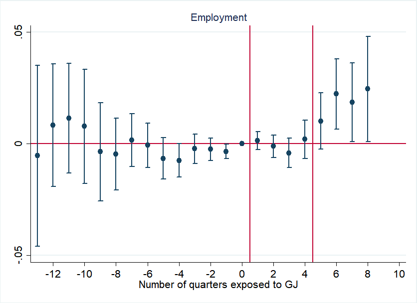
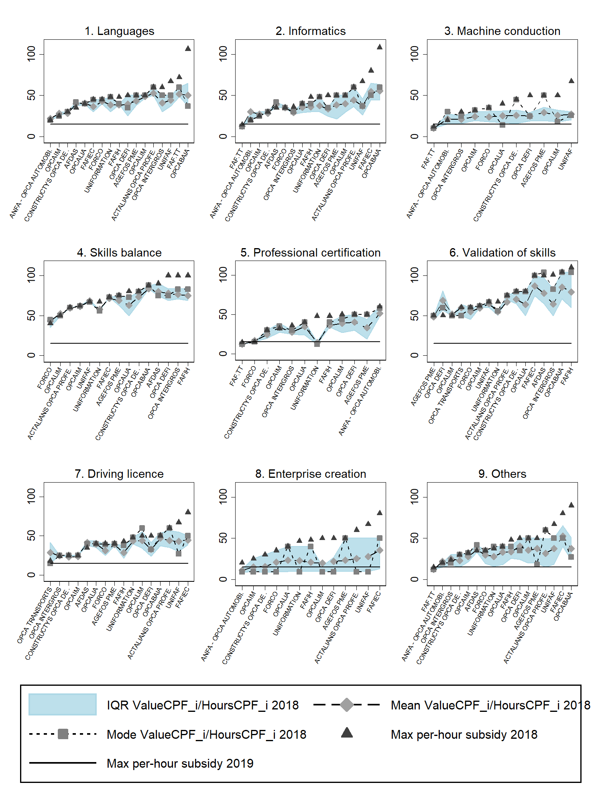

  My fields of research are Labor and Public Economics, where I focus on policy evaluation and on using its results to derive relevant structural parameters. My PhD thesis evaluates three different public policies -- a combination of activation policies and cash transfers, an individual learning account, and restraints to local authorities spending -- to derive insights on, respectively, job search behavior, the elasticities of demand/supply of training, and the local spending multiplier. 

<h2>Work in progress</h2>

<h3>What Do NEETs Need? The Effect of Activation Policies and Cash Transfers</h3> <a href="slides_job_mkt.pdf">Slides</a> - <a href="Filippucci_NEETs.pdf">Draft</a>

Activation policies and cash transfers are often used jointly, but the literature only evaluated them one conditional on the other. This paper evaluates a large French program providing a year of cash transfers and intensive activation measures to disadvantaged youths Not in Employment Education of Training (NEETs). I develop a difference-in-difference methodology which extends De Chaisemartin and D'Haultfoeuille (2020) to a setting where rolling over a third dimension is needed. While no significant effect arises during enrollment in the program, after completion takers report +26 percentage points in the probability of employment and +71 hours worked on a quarterly basis. No effect is instead detected on wages. I investigate the mechanisms using the timing of activation measures, the phase-out of the cash transfer, and a framework with discrete labor supply and search frictions. I find that the zero effect during enrollment arises from a negative reaction to implicit taxation from transfer phase-out, lock-in from training, and a counterbalancing positive effect of activation. This suggests that the elasticity of labor supply, time constraints, and search frictions play a significant role for disadvantaged NEETs. Finally, if disincentives to work generated by the cash transfer are assumed larger, the results imply larger effect of activation, which suggests potential complementarities. 

<h3>Who Profits from Training Subsidies? Evidence from a French Individual Learning Account</h3> 
Joint with E. Corazza 

<a href="presentation_chaire_nov2020.pdf">Slides</a> - Working paper available on request

This paper studies the incidence and welfare effects of a particular kind of training subsidies, Individual Learning Accounts (ILA). We exploit a natural experiment provided by the reform of a French ILA, the <i>Compte personnel de formation</i> (CPF). First, we theoretically model the impact of changing the per-hour subsidy rate on demand and supply for training, using a simple partial equilibrium model. Informed by this, we study the impact of a reform of 2019, which differentially lowered the per-hour value of the CPF subsidy across industries. We highlight three results. First, the supply of training is between 15% and 50% less elastic than demand, so that more than half of the benefit of the subsidy is captured by training producers. Second, total hours of training undertaken are not significantly affected by subsidy changes, leading to estimates of demand and supply elasticities which are close to zero. This makes CPF subsidy a simple transfer to producers and trainees. The silver lining is that, when studied through the lenses of a sufficient statistics framework, the efficiency cost of CPF is also low. Third, we use data on revenues and expenses of training to see that the reduction of the subsidy eventually translates in a reduction of producers' profits, with no effect on labor costs and employment of trainers.

<h3>The Impact of Fiscal Austerity on Local Economies</h3> 
Joint with A. Cerrato

Fiscal consolidation is often a necessity for local governments, but the cost of austerity is an open empirical question. Quasi-experimental estimates of local-economy multipliers range between 1.5 and 1.8, but they are rarely obtained with generally valid shocks. We exploit the extension of tight budget rules in Italy in 2012 to municipalities below 5000 inhabitants, which generates an increase of half a percentage point in net surplus to GDP, persisting for three years, and a decrease of 0.25\% in total income declared, significant only the third year after the reform. The estimated effect on output is widely driven by the extensive margin, i.e. a decrease in the number of individuals declaring positive income. The result is exactly replicated using local labor markets as unit of analysis, with the share of treated municipalities as continuous treatment variable. However, when using data on local labor income estimated from social security, the effect is always insignificant, suggesting that a considerable part of the drop in income may correspond to fictitious changes of residency, to avoid local taxation. This evidence is hardly consistent with local multipliers above 1, suggesting a low cost of fiscal consolidation.  

<h2>Publications</h2>
<h3>Did Covid-19 hit harder in peripheral areas? The case of Italian municipalities</h3>  

Joint with F. Armillei and T. Fletcher 

<a href="https://www.sciencedirect.com/science/article/pii/S1570677X21000423">Published on Economics and Human Biology</a> - <a href="Covid_Paper_2_0___Published (1).pdf">Preprint</a> - A previous version circulated as a <a href="https://www.localopportunitieslab.it/wp-content/uploads/2020/10/Covid_paper-4.pdf">LOL working paper</a> - <a href="https://www.lavoce.info/archives/69032/dai-dati-comunali-una-mappa-del-rischio-coronavirus/">Press article</a>.

  
The first wave of Covid-19 pandemic had a geographically heterogeneous impact even within the most severely hit regions. Exploiting a triple-differences methodology, we find that in Italy Covid-19 hit relatively harder in peripheral areas: the excess mortality in peripheral areas was almost double that of central ones in March 2020 (1.2 additional deaths every 1000 inhabitants). We leverage a rich dataset on Italian municipalities to explore mechanisms behind this gradient. We first show that socio-demographic and economic features at municipal level are highly collinear, making it hard to identify single-variable causal relationships. Using Principal Components Analysis we model excess mortality and show that areas with higher excess mortality have lower income, lower education, larger households, lower trade and higher industrial employments, and older population. Our findings highlight a strong centre-periphery gradient in the harshness of Covid-19, which we believe is also highly relevant from a policy-making standpoint.

