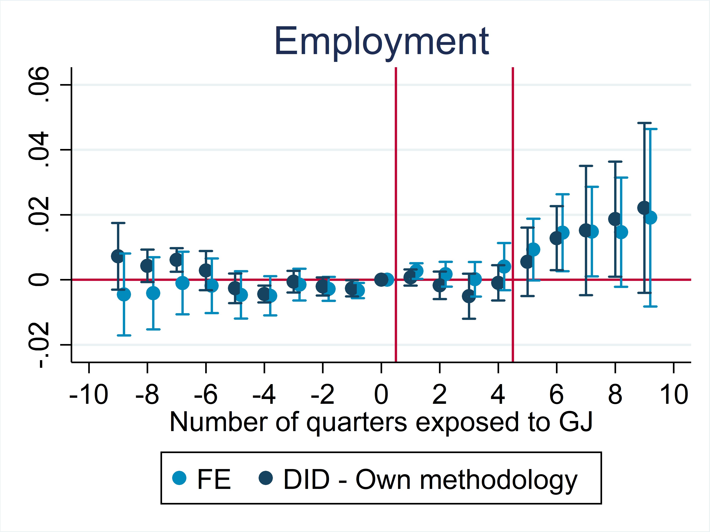

  My approach relies on using policy evaluation to derive relevant structural parameters, focusing on Labor and Public Economics. My PhD thesis exploits a program for NEETs, an individual learning account, and local budget rules to derive insights on -- respectively -- job search behavior, the elasticities of training supply, and the local spending multiplier. 

<h2>Job Market Paper</h2>

<h3>What Do NEETs Need? The Effect of Activation Policies and Cash Transfers</h3> <a href="slides_job_mkt.pdf">Slides</a> - <a href="Filippucci_NEETs.pdf">Draft</a>

Active and passive labor market policies are often used jointly, but the literature has only evaluated them one conditional on the other. This paper evaluates a flagship French program for disadvantaged youth Not in Employment Education or Training (NEETs) that provided a year of cash transfers and intensive activation measures. I exploit the staggered adoption of the program using a classical event study and a difference-in-differences methodology that extends De Chaisemartin and D'Haultfoeuille (2020) to a setting where individuals enter the population of interest in cohorts. The results highlight a strong positive joint effect of active and passive policies (+21 percentage points in employment, +63\% with respect to control) after youths exit the program. During program enrollment, I show that part-time employment decreases in the first semester -- when youths are busy in activation measures -- while in the second semester the decrease is concentrated in income brackets where the cash transfer is phased-out with labor income. This suggests that cash transfers and lock-in from training reduce youth employment, but this is more than compensated by the positive effect of activation measures.

<h2>Work in progress</h2>
<h3>Who Profits from Training Subsidies? Evidence from a French Individual Learning Account</h3> 
Joint with E. Corazza 

<a href="presentation_chaire_nov2020.pdf">Slides</a>- <a href="Draft_CPF.pdf">Draft</a> - <a href="DA_evaluation_GJ.pdf">French Ministry of Labor policy note</a>

This paper studies the incidence and welfare effects of a particular kind of training subsidies, Individual Learning Accounts (ILA). We exploit a natural experiment provided by the reform of a French ILA, the <i>Compte personnel de formation</i> (CPF). First, we theoretically model the impact of changing the per-hour subsidy rate on demand and supply for training, using a simple partial equilibrium model. Informed by this, we study the impact of a reform of 2019, which differentially lowered the per-hour value of the CPF subsidy across industries. We highlight three results. First, the supply of training is between 15% and 50% less elastic than demand, so that more than half of the benefit of the subsidy is captured by training producers. Second, total hours of training undertaken are not significantly affected by subsidy changes, leading to estimates of demand and supply elasticities which are close to zero. This makes CPF subsidy a simple transfer to producers and trainees. The silver lining is that, when studied through the lenses of a sufficient statistics framework, the efficiency cost of CPF is also low. Third, we use data on revenues and expenses of training to see that the reduction of the subsidy eventually translates in a reduction of producers' profits, with no effect on labor costs and employment of trainers.

<h3>The Impact of Fiscal Austerity on Local Economies</h3> 
Joint with A. Cerrato

Fiscal consolidation is often a necessity for local governments, but the cost of austerity is an open empirical question. Quasi-experimental estimates of local-economy multipliers range between 1.5 and 1.8, but most estimates are obtained from expansionary shocks, often during recessions. We exploit the extension of tighter budget rules in 2012 to municipalities below 5000 inhabitants, which generates an increase of half a percentage point in net surplus to local income, persisting for three years, and a decrease of 0.25\% in total income declared, significant only the third year after the reform. The estimated effect on output is widely driven by the extensive margin, i.e. a decrease in the number of individuals declaring positive income. The result is exactly replicated using local labor markets as unit of analysis, with the share of treated municipalities as continuous treatment variable. However, when using data on local labor income estimated from social security, the effect is always insignificant, suggesting that a considerable part of the drop in income may correspond to fictitious changes of residency. This evidence is suggestive of a low cost of fiscal consolidation, with local economy multiplier smaller than 1 for fiscal contraction.  

<h2>Publications</h2>
<h3>Did Covid-19 hit harder in peripheral areas? The case of Italian municipalities</h3>  

Joint with F. Armillei and T. Fletcher 

<a href="https://www.sciencedirect.com/science/article/pii/S1570677X21000423">Published on Economics and Human Biology</a> - <a href="Covid_Paper_2_0___Published (1).pdf">Preprint</a> - A previous version circulated as a <a href="https://www.localopportunitieslab.it/wp-content/uploads/2020/10/Covid_paper-4.pdf">LOL working paper</a> - <a href="https://www.lavoce.info/archives/69032/dai-dati-comunali-una-mappa-del-rischio-coronavirus/">Press article</a>.

  
The first wave of Covid-19 pandemic had a geographically heterogeneous impact even within the most severely hit regions. Exploiting a triple-differences methodology, we find that in Italy Covid-19 hit relatively harder in peripheral areas: the excess mortality in peripheral areas was almost double that of central ones in March 2020 (1.2 additional deaths every 1000 inhabitants). We leverage a rich dataset on Italian municipalities to explore mechanisms behind this gradient. We first show that socio-demographic and economic features at municipal level are highly collinear, making it hard to identify single-variable causal relationships. Using Principal Components Analysis we model excess mortality and show that areas with higher excess mortality have lower income, lower education, larger households, lower trade and higher industrial employments, and older population. Our findings highlight a strong centre-periphery gradient in the harshness of Covid-19, which we believe is also highly relevant from a policy-making standpoint.

